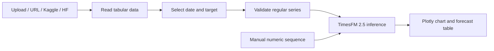

# TimesFM Forecast Studio

A local-first Streamlit application for **zero-shot, univariate forecasting** with Google TimesFM 2.5 (200M, PyTorch). Load CSV, Parquet, or XLSX data from your computer, public URLs, Kaggle, or Hugging Face; then generate point and quantile forecasts without training a model.

> ⚠️ Forecasts are analytical estimates, not guarantees. Evaluate TimesFM against held-out data and domain baselines before using outputs for operational, financial, safety, or policy decisions.

## Features

| Area | Capability |
|---|---|
| Data sources | Multi-file upload, HTTP/S URL, Kaggle, Hugging Face Hub |
| Formats | CSV, Parquet, XLSX with worksheet selection |
| Preparation | Datetime detection, numeric coercion, regular-grid validation, context slicing |
| Forecasting | TimesFM 2.5 standard and XReg covariate forecasts with point, mean, and q10–q90 outputs |
| Hardware | Auto, CPU, or NVIDIA CUDA selection |
| EDA | Quality, distribution, trend, seasonality, ACF, STL, ADF, and robust outlier diagnostics |
| Evaluation | 1–10 rolling-origin windows, point/probabilistic metrics, latency, and interval anomalies |
| Export | Direct CSV plus self-contained HTML, vector PDF, and complete ZIP report bundles |
| Visualization | Interactive Plotly forecast, EDA, backtest, and anomaly charts |
| Playground | Comma/newline-separated numeric sequence forecasting |
| Local operation | Content-addressed data cache and offline model reuse |

## Quick start

Prerequisites are Git, [`uv`](https://docs.astral.sh/uv/), and enough local disk/memory for PyTorch and the checkpoint. The project targets Python 3.14.

```powershell
git clone https://github.com/pypi-ahmad/timesfm-forecasting-studio.git
Set-Location timesfm-forecasting-studio
uv python install 3.14
uv sync --locked --group dev
uv run streamlit run app.py
```

`uv` and `uv.lock` are canonical. A pip-compatible dependency list is also available:

```powershell
py -3.14 -m venv .venv
.\.venv\Scripts\Activate.ps1
python -m pip install -r requirements.txt
streamlit run app.py
```

The lockfile selects the PyTorch CUDA 13.0 index. CPU remains selectable in the UI; consult the [installation tutorial](docs/tutorial/02_local_installation.md) before changing the locked PyTorch source.

## Runtime contract

| Item | Choice |
|---|---|
| Model | `google/timesfm-2.5-200m-pytorch` |
| Revision | `1d952420fba87f3c6dee4f240de0f1a0fbc790e3` |
| Context | 2–16,256 observations, compiled in 32-point buckets |
| Horizon | 1–1,024, compiled in 128-point buckets |
| Combined limit | Rounded context + horizon ≤ 16,384 |
| Input | One one-dimensional `float32` array per series |
| Output | q50 point forecast plus mean and q10–q90 distribution |
| Frequency | Timestamp validation and future-index generation only |

TimesFM 2.5 does not receive a frequency indicator. The selected hourly/daily/weekly/monthly frequency validates the historical grid and labels future points; seasonal behavior must be present in the numeric context. See the [official TimesFM repository](https://github.com/google-research/timesfm).

## Credentials and cache

Prefer environment variables or local Streamlit secrets. Values are never intentionally displayed or logged.

| Provider/behavior | Variables |
|---|---|
| Hugging Face | `HF_TOKEN` |
| Kaggle current auth | `KAGGLE_API_TOKEN` |
| Kaggle legacy auth | `KAGGLE_USERNAME`, `KAGGLE_KEY` |
| Cache location | `TIMESFM_APP_CACHE` |
| Cached-only model/HF access | `TIMESFM_OFFLINE=true` |

```powershell
Copy-Item .streamlit/secrets.toml.example .streamlit/secrets.toml
```

`.streamlit/secrets.toml` is gitignored. The checkpoint loads on the first forecast and is cached under `.cache/huggingface` by default. After a successful online load, offline mode can reuse the exact pinned revision. Kaggle and public URL acquisition still require a network.

## Guided workflow

Use the stage selector from left to right:

1. **Load & configure** — upload or resolve one or more datasets. Clearing this stage removes
   loaded session data and generated outputs without deleting the local content-addressed cache.
2. **Analyze** — choose the active dataset, columns, and seasonal period, then inspect the full EDA.
3. **Forecast** — run standard TimesFM in batch or select XReg for an extended covariate table.
4. **Evaluate & anomalies** — run 1–10 rolling-origin windows and inspect accuracy, calibration,
   throughput, and actuals outside the q10–q90 interval.
5. **Export** — download forecast CSV, interactive HTML, PDF, or a ZIP containing all tables and
   the model/data provenance manifest.

The **Manual simulator** toggle in the sidebar remains available for quick numeric sequences.

### XReg input contract

For covariate forecasting, the target must contain a finite historical context followed by exactly
the future blank rows that define the horizon. Dynamic numerical and categorical covariates must be
complete across both context and future rows. TimesFM uses the selected Torch device; the linear
XReg component runs on CPU for Windows compatibility.

## Forecast workflows



### Dataset forecast

1. Load one or more supported files in **Data Loading**.
2. Choose the worksheet, detected date column, numeric target, and positivity for each file.
3. Set context, horizon, frequency, and Auto/CPU/CUDA in the sidebar.
4. Run forecasting and inspect each dataset's chart, metadata, and quantile table.

Duplicate or irregular timestamps and trailing target gaps are rejected. Leading target gaps are trimmed; internal gaps are reported and linearly interpolated by TimesFM before inference.

### Manual forecast

Open **Manual Simulator** and enter at least two finite values:

```text
10, 12, 15, 14, 18, 21
```

The manual workflow does not invent a datetime index; future positions are plotted as integers.

## Zero-to-Master tutorial

| Part | Outcome |
|---|---|
| [1. TimesFM foundations](docs/tutorial/01_timesfm_intro.md) | Understand TSFMs, zero-shot mathematics, patching, quantiles, and model comparisons |
| [2. Local installation](docs/tutorial/02_local_installation.md) | Install with uv/venv/Conda, verify CUDA/CPU, authenticate, and manage cache |
| [3. Data engineering](docs/tutorial/03_data_engineering.md) | Build regular series from local, URL, Kaggle, and Hugging Face data |
| [4. Forecasting mastery](docs/tutorial/04_forecasting_mastery.md) | Choose context/horizon, interpret charts, manage OOM, and design evaluation |

## Architecture

```text
app.py
src/loader.py                   stable multi-file loading facade
src/integrations.py             Kaggle and Hugging Face search clients
src/predictor.py                device-aware Pandas predictor facade
src/timesfm_app/
  config.py                     environment and secret configuration
  contracts.py                  boundary dataclasses and model limits
  ingestion/
    readers.py                  CSV / Parquet / XLSX
    resolvers.py                upload and SSRF-hardened URL caching
    providers.py                Kaggle and Hugging Face resolution
  forecasting/
    preprocessing.py            time-series validation and slicing
    runtime.py                  checkpoint load, compile, inference
  ui/                           Streamlit pages, controls, charts, tables
tests/
  unit/                         contracts, ingestion, providers, runtime
  integration/                  model-free Streamlit smoke tests
```

The public URL resolver allows only HTTP/S, revalidates redirects, blocks private and special-purpose IP ranges, limits downloads to 200 MiB, checks supported extensions and binary signatures, and strips queries from retained metadata. Remote files remain untrusted: compressed formats can expand significantly in local memory.

## Commands

| Command | Purpose |
|---|---|
| `uv sync --locked --group dev` | Reproduce runtime and development dependencies |
| `uv run streamlit run app.py` | Start the application |
| `uv run pytest` | Run unit and integration tests |
| `uv run ruff check src tests app.py` | Run lint checks |
| `uv run ruff format --check src tests app.py` | Verify formatting |

## Operational limits

| Limit | Effect |
|---|---|
| One model per process | Model resource is cached and compile/inference is lock-serialized |
| Compile-key changes | New rounded context/horizon or positivity may trigger recompilation |
| Univariate input | Extra columns are not model covariates |
| Rolling backtesting | Uses non-overlapping windows and performs one model call per window |
| XReg dependency cost | CPU JAX/JAXLIB, scikit-learn, and their numerical dependencies increase install size |
| Local parsing | XLSX/Parquet expansion consumes process memory |

## Contributing and support

Read [CONTRIBUTING.md](CONTRIBUTING.md) before proposing changes. Use the structured GitHub issue forms for reproducible bugs, focused features, and documentation problems. General usage guidance is in [SUPPORT.md](SUPPORT.md). Report vulnerabilities privately according to [SECURITY.md](SECURITY.md), never through a public issue.

All contributors must follow the [Code of Conduct](CODE_OF_CONDUCT.md).

## Citation and upstream work

TimesFM is developed by Google Research. This repository is an independent Streamlit application and is not an official Google product.

- Google Research, [TimesFM repository](https://github.com/google-research/timesfm).
- Das et al., [*A Decoder-only Foundation Model for Time-series Forecasting*](https://arxiv.org/abs/2310.10688).
- Google Research, [TimesFM research overview](https://research.google/blog/a-decoder-only-foundation-model-for-time-series-forecasting/).

## License

This application is released under the [MIT License](LICENSE). TimesFM model weights, upstream code, datasets, and third-party dependencies remain subject to their respective licenses and terms.
