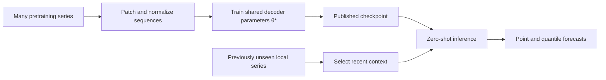
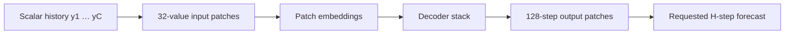
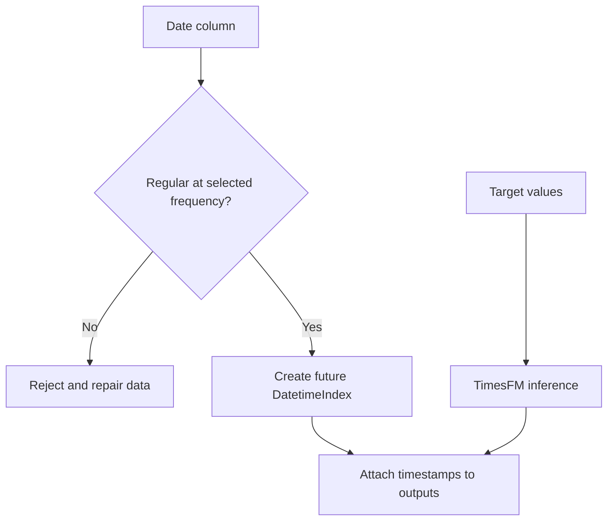

# TimesFM Zero to Master — 1. Foundations

[Tutorial home](../../README.md#zero-to-master-tutorial) · **Part 1 of 4** · [Next: Local installation →](02_local_installation.md)

This chapter builds the mental model needed to use TimesFM responsibly. You will learn what a **time-series foundation model (TSFM)** is, how zero-shot forecasting differs from fitting a model to one dataset, and where TimesFM sits beside ARIMA, Prophet, and DeepAR.

## 1. Time series and forecasting

A **time series** is an ordered sequence of measurements. For a univariate series,

\[
\mathbf{y}_{1:T}=(y_1,y_2,\ldots,y_T),
\]

each value is associated with an ordered timestamp. Forecasting uses a context window of the latest \(C\) observations to estimate a future horizon of \(H\) observations:

\[
\hat{\mathbf{y}}_{T+1:T+H}=f(\mathbf{y}_{T-C+1:T}).
\]

The repository intentionally implements **univariate** forecasting: one numeric target is passed to the model. Other uploaded columns may help you inspect the dataset, but they are not covariates.

| Term | Meaning in this repository | Example |
|---|---|---|
| **Observation** | One timestamped target value | Hourly energy demand at 14:00 |
| **Context** | Historical values supplied to the model | Previous 720 hours |
| **Forecast horizon** | Number of future steps requested | Next 48 hours |
| **Frequency** | Spacing of the timestamp grid | Hourly, daily, month-end |
| **Point forecast** | One estimate per future step | The q50/median path |
| **Quantile forecast** | Estimate at probability level \(\tau\) | q10, q50, q90 |

> ⚠️ **Ordered does not mean regular.** This application requires a regular timestamp grid. A sorted series with random gaps is still irregular and is rejected until repaired.

## 2. What is a time-series foundation model?

A **foundation model** is pretrained on broad data and reused across downstream tasks. A TSFM applies this idea to temporal sequences. Rather than estimating fresh parameters from only the uploaded series, TimesFM starts with parameters learned from a large and diverse pretraining corpus.

Google describes TimesFM as a patched, decoder-only foundation model trained for zero-shot forecasting across domains and granularities. The current repository uses **TimesFM 2.5 200M for PyTorch**, pinned to a specific Hugging Face revision. See the [official TimesFM repository](https://github.com/google-research/timesfm), the [research paper](https://arxiv.org/abs/2310.10688), and the [Google Research overview](https://research.google/blog/a-decoder-only-foundation-model-for-time-series-forecasting/).

### 2.1 Patching

Passing every scalar as a separate transformer token would make long histories expensive. TimesFM groups consecutive observations into **input patches**. A simplified patch is

\[
\mathbf{p}_i=[y_{(i-1)P+1},\ldots,y_{iP}],
\]

where \(P\) is the input patch length. This app reflects TimesFM 2.5's 32-point input patch and 128-point output patch when it rounds compilation sizes.

Patching is not seasonal aggregation. Values are not averaged into a weekly or monthly statistic; they remain ordered within the model representation.

### 2.2 Probabilistic outputs

For a quantile level \(\tau\in(0,1)\), quantile regression is commonly expressed with the pinball loss

\[
\rho_\tau(u)=u\left(\tau-\mathbb{1}[u<0]\right),
\qquad u=y-\hat y_\tau.
\]

TimesFM 2.5 can produce a continuous-quantile forecast. Its Python interface returns ten channels per future step: the mean followed by q10 through q90. This application displays **q50 as the point forecast** and shades q10–q90. These are model-estimated predictive quantiles, not a guarantee that 80% of future observations will fall inside the band on every dataset.

## 3. Zero-shot transfer learning

Let \(\mathcal D_{\text{pre}}\) denote the pretraining collection and \(\mathcal L\) its forecasting objective. Pretraining can be summarized as

\[
\theta^*=\arg\min_\theta
\mathbb E_{\mathbf y\sim\mathcal D_{\text{pre}}}
\left[\mathcal L\big(f_\theta(\mathbf y_{1:t}),\mathbf y_{t+1:t+H}\big)\right].
\]

For a new series \(\mathbf z\) that was not used to fit task-specific parameters, zero-shot inference is

\[
\hat{\mathbf z}_{T+1:T+H}
=f_{\theta^*}(\mathbf z_{T-C+1:T}).
\]

The defining property is that \(\theta^*\) remains fixed: the app downloads and runs the checkpoint but does not fine-tune it on the uploaded series.

| Stage | Data used | Parameters changed? | Happens in this app? |
|---|---|---:|---:|
| Foundation pretraining | Large multi-domain corpus | Yes | No; performed by Google |
| Zero-shot inference | User-selected context | No | Yes |
| Fine-tuning | Labeled target-domain windows | Yes | No |
| Backtesting | Historical holdout windows | No model change required | Not automated |

> ⚠️ **Zero-shot is not zero-validation.** It removes task-specific training, not the need to compare forecasts against held-out observations and domain baselines.

## 4. TimesFM versus established approaches

The models solve related problems but make different tradeoffs. ARIMA and Prophet are normally fit per series. DeepAR learns a global autoregressive model from a collection of related series. TimesFM is pretrained broadly and can forecast a new series without target-domain fitting.

| Dimension | ARIMA | Prophet | DeepAR | TimesFM 2.5 |
|---|---|---|---|---|
| Core mechanism | Autoregression, differencing, moving-average errors | Additive trend, seasonalities, holidays | Global autoregressive recurrent network | Patched decoder-only foundation model |
| Typical fitting | One model per series | One model per series | Train on related-series panel | Pretrained checkpoint; zero-shot locally |
| Data assumptions | Stationarity after differencing; specified orders | Additive decomposable structure | Representative training panel and likelihood | Sufficient ordered context resembling learned patterns |
| Seasonality | Seasonal ARIMA orders | Explicit Fourier seasonalities | Learned from training data | Learned implicitly from values; no 2.5 frequency token |
| Exogenous features | Supported by ARIMAX variants | Regressors and holidays | Dynamic/static features in full formulation | Not exposed by this app |
| Uncertainty | Model-dependent intervals | Posterior/simulation-based intervals | Predictive distribution | Mean and quantiles |
| New-domain use | Refit | Refit | Usually retrain or adapt | Direct zero-shot inference |
| Interpretability | Coefficients and diagnostics | Trend/seasonality components | Neural latent state | Neural forecast path and quantiles |

Authoritative starting points are the [statsmodels ARIMA API](https://www.statsmodels.org/stable/generated/statsmodels.tsa.arima.model.ARIMA.html), [Prophet documentation](https://facebook.github.io/prophet/docs/quick_start.html), and the [DeepAR paper](https://arxiv.org/abs/1704.04110).

### 4.1 When each model is attractive

| Situation | Strong first baseline | Reason |
|---|---|---|
| Short, stable series with understood dynamics | ARIMA/ETS | Compact assumptions and diagnostics |
| Business series with calendar effects and known holidays | Prophet | Explicit trend, seasonal, and holiday components |
| Thousands of related product or sensor series with covariates | DeepAR | Joint training shares information across a panel |
| Many unrelated series or rapid exploration without training | TimesFM | Reusable zero-shot checkpoint |

No row declares a universal winner. A production decision should compare naive seasonal forecasts, statistical baselines, and TimesFM on the same rolling-origin evaluation.

## 5. What varying frequency means in TimesFM 2.5

TimesFM was designed to generalize across temporal granularities, but **TimesFM 2.5 removed the frequency indicator** from the model API, as documented in the [official release notes](https://github.com/google-research/timesfm#timesfm-25). In this application the selected frequency has two jobs:

1. Validate that the datetime index is exactly regular.
2. Generate future timestamps after the last observation.

It is not passed as an hourly/daily/monthly feature. The model sees the ordered numeric values; their patterns must communicate periodic structure.

## 6. Capability boundary of this repository

| Capability | Current behavior |
|---|---|
| Checkpoint | `google/timesfm-2.5-200m-pytorch` at a pinned commit |
| Context | 2–16,256 selected observations, subject to rounded combined limit |
| Horizon | 1–1,024 observations |
| Inputs | One 1-D float array per series |
| Batching | Compatible series share horizon and non-negative setting |
| Outputs | q50 point forecast plus mean and q10–q90 table |
| Hardware | Auto, CPU, or CUDA |
| Training | None |
| Covariates | Not supported by the app |
| Evaluation | User-managed; no built-in backtester |

> ⚠️ **Operational forecast is not business truth.** Distribution shift, structural breaks, promotions, outages, and policy changes may be absent from the numeric history. Pair model output with domain review.

## 7. Knowledge checkpoint

You are ready for installation if you can answer these questions:

| Question | Expected answer |
|---|---|
| Does the app train TimesFM on an uploaded file? | No; it performs zero-shot inference. |
| Does selecting “daily” send a daily token to TimesFM 2.5? | No; it validates and extends timestamps. |
| What is the displayed point forecast? | q50, the median quantile channel. |
| Why can TimesFM accept a previously unseen domain? | Shared parameters were pretrained across broad time-series data. |
| What must still happen before production use? | Held-out evaluation against relevant baselines. |

## References

- Google Research, [TimesFM repository and TimesFM 2.5 usage](https://github.com/google-research/timesfm).
- Das et al., [*A Decoder-only Foundation Model for Time-series Forecasting*](https://arxiv.org/abs/2310.10688).
- Google Research, [*A decoder-only foundation model for time-series forecasting*](https://research.google/blog/a-decoder-only-foundation-model-for-time-series-forecasting/).
- Salinas et al., [*DeepAR: Probabilistic Forecasting with Autoregressive Recurrent Networks*](https://arxiv.org/abs/1704.04110).
- statsmodels, [ARIMA reference](https://www.statsmodels.org/stable/generated/statsmodels.tsa.arima.model.ARIMA.html).
- Meta Open Source, [Prophet documentation](https://facebook.github.io/prophet/docs/quick_start.html).

[Next: Local installation →](02_local_installation.md)
