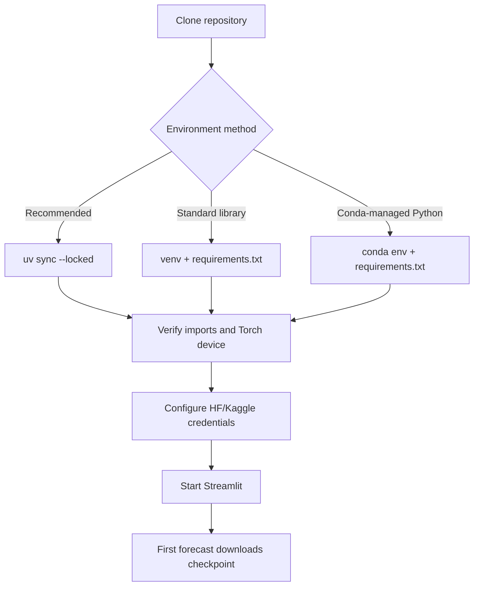

# TimesFM Zero to Master — 2. Local Installation

[← Previous: Foundations](01_timesfm_intro.md) · [Tutorial home](../../README.md#zero-to-master-tutorial) · **Part 2 of 4** · [Next: Data engineering →](03_data_engineering.md)

This chapter installs the repository locally, verifies CPU or NVIDIA CUDA execution, authenticates Hugging Face, and prepares the model cache. Commands are Windows-first because that is the repository's locked development target; Bash equivalents are included where they differ.

## 1. Runtime contract

| Component | Repository value | Why it matters |
|---|---|---|
| Python | `>=3.14,<3.15` | The lockfile resolves for Python 3.14 |
| Package manager | `uv` with `uv.lock` | Reproducible canonical environment |
| PyTorch | 2.13.0 | TimesFM PyTorch backend |
| PyTorch index | CUDA 13.0 | Selected by `pyproject.toml` and `uv.lock` |
| TimesFM | 2.0.2 package | Provides the TimesFM 2.5 model class |
| Model | `google/timesfm-2.5-200m-pytorch` | Downloaded lazily on first forecast |
| Model revision | `1d952420fba87f3c6dee4f240de0f1a0fbc790e3` | Reproducible checkpoint |

The authoritative dependency declarations are `pyproject.toml` and `uv.lock`. `requirements.txt` is retained for pip-compatible environments.



## 2. Prerequisites

| Requirement | Check | Installation source |
|---|---|---|
| Git | `git --version` | [Git downloads](https://git-scm.com/downloads) |
| uv | `uv --version` | [Official uv installation](https://docs.astral.sh/uv/getting-started/installation/) |
| NVIDIA driver, optional | `nvidia-smi` | [NVIDIA driver downloads](https://www.nvidia.com/download/index.aspx) |
| Conda, optional | `conda --version` | [Conda environment guide](https://docs.conda.io/projects/conda/en/latest/user-guide/tasks/manage-environments.html) |

Install uv on Windows if needed:

```powershell
powershell -ExecutionPolicy ByPass -c "irm https://astral.sh/uv/install.ps1 | iex"
uv --version
```

On macOS/Linux:

```bash
curl -LsSf https://astral.sh/uv/install.sh | sh
uv --version
```

> ⚠️ Review organization policy before executing any downloaded installer. The commands above are the methods published in the [official uv documentation](https://docs.astral.sh/uv/getting-started/installation/).

## 3. Clone the repository

Clone the published project repository:

```powershell
git clone https://github.com/pypi-ahmad/timesfm-forecasting-studio.git
Set-Location timesfm-forecasting-studio
```

Bash:

```bash
git clone https://github.com/pypi-ahmad/timesfm-forecasting-studio.git
cd timesfm-forecasting-studio
```

Confirm that `app.py`, `pyproject.toml`, `uv.lock`, `src/`, and `tests/` are present before installing anything.

## 4. Recommended setup with uv

`uv` reads the project metadata, installs a compatible Python when necessary, creates `.venv`, and synchronizes exact locked dependencies.

```powershell
uv python install 3.14
uv sync --locked --group dev
uv run python -c "import streamlit, timesfm, torch; print(torch.__version__)"
```

Start the app:

```powershell
uv run streamlit run app.py
```

Streamlit prints a local URL, normally `http://localhost:8501`. Stop it with <kbd>Ctrl</kbd>+<kbd>C</kbd>.

> ✅ Use `uv run ...` instead of manually activating `.venv`; uv guarantees the command runs inside the project environment.

## 5. Alternative: Python venv and pip

The standard-library [`venv`](https://docs.python.org/3/library/venv.html) path is useful when uv is unavailable. It follows `requirements.txt`, not the canonical lockfile.

### Windows PowerShell

```powershell
py -3.14 -m venv .venv
.\.venv\Scripts\Activate.ps1
python -m pip install --upgrade pip
python -m pip install -r requirements.txt
streamlit run app.py
```

If script execution is restricted, use the environment's interpreter directly:

```powershell
.\.venv\Scripts\python.exe -m streamlit run app.py
```

### macOS/Linux

```bash
python3.14 -m venv .venv
source .venv/bin/activate
python -m pip install --upgrade pip
python -m pip install -r requirements.txt
streamlit run app.py
```

> ⚠️ `requirements.txt` pins direct dependencies but does not encode the CUDA 13.0 package source from `uv.lock`. Verify the installed PyTorch build before assuming GPU support.

## 6. Alternative: Conda environment

Use Conda to manage Python and isolation, then install the repository's declared Python packages with pip:

```powershell
conda create --name timesfm-studio python=3.14 -y
conda activate timesfm-studio
python -m pip install -r requirements.txt
streamlit run app.py
```

Remove this environment later with `conda env remove --name timesfm-studio`; do not delete unrelated Conda environments.

| Method | Reproducibility here | GPU source encoded? | Recommended use |
|---|---:|---:|---|
| uv + lockfile | Highest | Yes, CUDA 13.0 | Development and verification |
| venv + pip | Direct pins only | No | Simple compatibility setup |
| Conda + pip | Direct pins only | No | Existing Conda workflows |

## 7. CPU versus CUDA

The app exposes **Auto**, **CPU**, and **CUDA** device preferences. Auto chooses CUDA when `torch.cuda.is_available()` is true; otherwise it uses CPU. An explicit CUDA request fails clearly if CUDA is unavailable.

### 7.1 Verify PyTorch

With uv:

```powershell
uv run python -c "import torch; print({'torch': torch.__version__, 'cuda_build': torch.version.cuda, 'cuda_available': torch.cuda.is_available(), 'devices': torch.cuda.device_count()})"
```

With an activated venv/Conda environment, omit `uv run`.

| Result | Meaning | App selection |
|---|---|---|
| `cuda_available: True` | Driver and wheel can expose an NVIDIA GPU | Auto or CUDA |
| `cuda_available: False` and `cuda_build` has a value | CUDA wheel exists but runtime cannot use a GPU | CPU; inspect driver/device |
| `cuda_build: None` | CPU-only PyTorch build | CPU |

PyTorch's supported wheel combinations change over time; consult the [official PyTorch installation selector](https://pytorch.org/get-started/locally/) before replacing the locked source.

### 7.2 Resource tradeoffs

| Device | Benefit | Cost |
|---|---|---|
| CUDA | Faster model inference | GPU memory and compatible NVIDIA stack required |
| CPU | Works without NVIDIA hardware | Higher latency and host-memory use |

> ⚠️ **Out of memory:** reduce context, horizon, or the number of simultaneously forecast datasets. Close other GPU-heavy programs. Switching to CPU avoids GPU-memory pressure but may require substantial RAM and more time.

## 8. Hugging Face authentication and caching

Public model files often work without a token, but authentication raises reliability and is required for gated/private assets. Create a **read-only** token in [Hugging Face settings](https://huggingface.co/settings/tokens).

### 8.1 CLI login

The installed `huggingface_hub` package provides the `hf` command:

```powershell
uv run hf auth login
uv run hf auth whoami
```

Paste the token only into the secure prompt. The [Hugging Face authentication guide](https://huggingface.co/docs/huggingface_hub/quick-start#authentication) explains token storage and environment-variable precedence.

### 8.2 Environment variables

For the current PowerShell process:

```powershell
$env:HF_TOKEN = "paste-token-in-your-terminal"
$env:TIMESFM_APP_CACHE = ".cache"
uv run streamlit run app.py
```

Bash:

```bash
export HF_TOKEN="paste-token-in-your-terminal"
export TIMESFM_APP_CACHE=".cache"
uv run streamlit run app.py
```

Do not save those literal examples with a real token. Environment variables disappear when the shell closes unless deliberately persisted.

### 8.3 Streamlit secrets

```powershell
Copy-Item .streamlit/secrets.toml.example .streamlit/secrets.toml
```

Edit `.streamlit/secrets.toml` locally. It is gitignored. The app accepts these names:

```toml
HF_TOKEN = "hf_read_only_token"
KAGGLE_API_TOKEN = "kaggle_token"
TIMESFM_APP_CACHE = ".cache"
TIMESFM_OFFLINE = "false"
```

> ⚠️ Never commit `.streamlit/secrets.toml`, `kaggle.json`, tokens, or terminal output containing credentials.

### 8.4 First download and offline mode

The model is lazy-loaded. Opening the UI does not download weights; the first forecast does. Files are cached under `.cache/huggingface` unless `TIMESFM_APP_CACHE` changes the root.

After one successful online forecast, restart in offline mode:

```powershell
$env:TIMESFM_OFFLINE = "true"
uv run streamlit run app.py
```

Offline mode sets Hugging Face downloads to local-only. URL and Kaggle retrieval still require a network, and an uncached model/dataset fails rather than silently fetching it.

## 9. Kaggle credentials

The app accepts either the current token or legacy username/key pair:

| Preferred | Legacy |
|---|---|
| `KAGGLE_API_TOKEN` | `KAGGLE_USERNAME` and `KAGGLE_KEY` |

Set only one mechanism. Use the token created from your Kaggle account settings and keep it outside the repository. The official [Kaggle API repository](https://github.com/Kaggle/kaggle-api) documents authentication options.

## 10. Installation verification

Run model-free checks before downloading weights:

```powershell
uv run pytest
uv run ruff check src tests app.py
uv run ruff format --check src tests app.py
```

Then start Streamlit and perform a manual forecast using a short sequence. The first model load may take materially longer than later forecasts because the checkpoint must be downloaded and initialized.

## 11. Troubleshooting matrix

| Symptom | Likely cause | Corrective action |
|---|---|---|
| `No solution found` during `uv sync` | Wrong Python or incompatible platform | Run `uv python install 3.14`, then retry locked sync |
| `CUDA was requested but is unavailable` | CUDA selected without a usable device | Choose Auto/CPU; inspect `nvidia-smi` and Torch check |
| Checkpoint loading failed | Network, token, cache, or device issue | Disable offline mode, verify `HF_TOKEN`, cache permissions, and device |
| Offline file not found | Checkpoint revision was never cached | Run one online forecast first |
| PowerShell blocks activation | Execution policy restricts scripts | Use `uv run` or the venv Python executable directly |
| Very slow first forecast | Download and model initialization | Wait for first completion; subsequent loads use cache |
| Disk usage is unexpectedly high | PyTorch, checkpoint, and Windows no-symlink cache | Move `TIMESFM_APP_CACHE` to a larger local volume |

## References

- Astral, [uv installation](https://docs.astral.sh/uv/getting-started/installation/) and [project synchronization](https://docs.astral.sh/uv/concepts/projects/sync/).
- Python, [`venv` documentation](https://docs.python.org/3/library/venv.html).
- Conda, [managing environments](https://docs.conda.io/projects/conda/en/latest/user-guide/tasks/manage-environments.html).
- PyTorch, [local installation selector](https://pytorch.org/get-started/locally/).
- Hugging Face, [authentication](https://huggingface.co/docs/huggingface_hub/quick-start#authentication) and [cache management](https://huggingface.co/docs/huggingface_hub/guides/manage-cache).
- Kaggle, [official API client](https://github.com/Kaggle/kaggle-api).
- Google Research, [TimesFM repository](https://github.com/google-research/timesfm).

[← Previous: Foundations](01_timesfm_intro.md) · [Next: Data engineering →](03_data_engineering.md)
