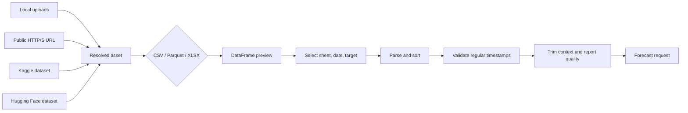
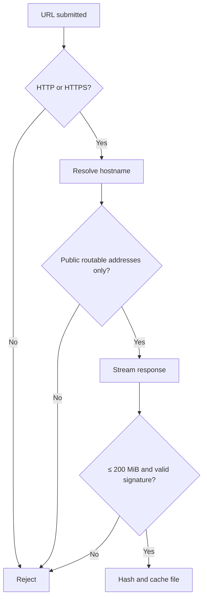
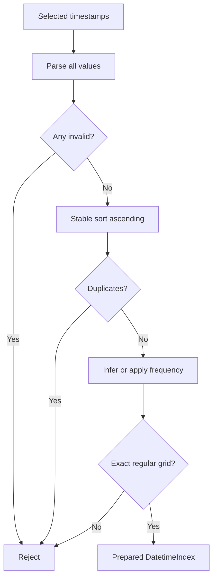
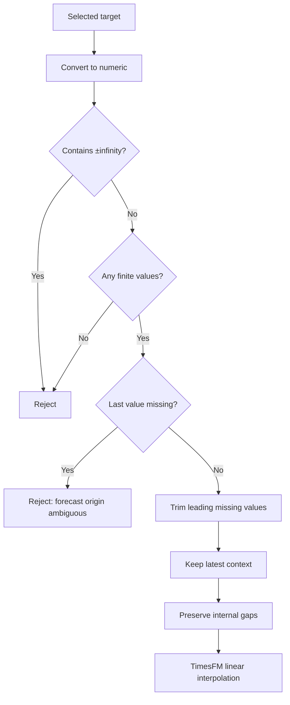
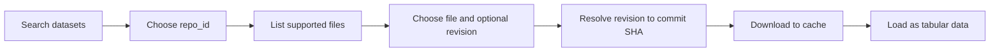

# TimesFM Zero to Master — 3. Data Engineering

[← Previous: Local installation](02_local_installation.md) · [Tutorial home](../../README.md#zero-to-master-tutorial) · **Part 3 of 4** · [Next: Forecasting mastery →](04_forecasting_mastery.md)

Forecast quality begins before inference. This chapter turns local or remote tabular data into the exact **regular, univariate, ordered context** required by the application.

## 1. Ingestion architecture



All sources eventually become a `pandas.DataFrame`. The same timestamp and target validation then applies regardless of where the bytes originated.

## 2. Supported file formats

| Format | Reader | Strength | Watch for |
|---|---|---|---|
| CSV | `pandas.read_csv` | Portable and inspectable | Delimiters, locale-specific numbers, ambiguous dates |
| Parquet | `pandas.read_parquet` | Typed, compressed, efficient | Requires valid Parquet signature and PyArrow |
| XLSX | `pandas.read_excel` | Familiar multi-sheet workbooks | Formula results, merged headers, workbook expansion in memory |

Legacy `.xls`, TSV, JSON, ZIP archives, and database connections are not supported. Convert them to CSV, Parquet, or XLSX before loading.

### Recommended table shape

```text
timestamp,target
2026-01-01 00:00:00,105.4
2026-01-01 01:00:00,103.8
2026-01-01 02:00:00,107.1
```

The table may contain extra columns, but the app uses exactly one date column and one numeric target per forecast.

## 3. Loading local files

1. Start the application with `uv run streamlit run app.py`.
2. Open **Data Loading**.
3. Choose one or more `.csv`, `.parquet`, or `.xlsx` files.
4. For every XLSX file, choose a worksheet.
5. Review the preview and detected datetime candidates.
6. Select the date column, target column, and whether the target must be non-negative.

Each upload is content-hashed and cached below `.cache/data`. Multiple uploads retain independent column mappings; two files do not need identical column names.

| Multi-file behavior | Result |
|---|---|
| Same horizon and non-negative setting | Compatible requests can share a TimesFM batch |
| Different date/target names | Supported through per-file mappings |
| One invalid file | Individual retry isolates the failing dataset |
| Same filename and content uploaded again | Existing content-addressed path is reused |

> ⚠️ A renamed file with identical bytes has the same hash directory but a distinct cached filename. Cache identity therefore preserves both content and the sanitized source name.

## 4. Loading a public URL

Paste a direct HTTP or HTTPS URL ending in `.csv`, `.parquet`, or `.xlsx`. The resolver deliberately treats remote files as untrusted.



The resolver provides these controls:

| Control | Purpose |
|---|---|
| HTTP/S allowlist | Rejects local file and custom schemes |
| No embedded credentials | Prevents username/password leakage in URLs |
| DNS/IP validation | Blocks private, loopback, link-local, multicast, reserved, and unspecified addresses |
| Redirect revalidation | Validates every destination, up to the redirect limit |
| 200 MiB streaming limit | Bounds network and cache use |
| Extension/signature checks | Requires supported type; validates Parquet/XLSX magic bytes |
| Query stripping in metadata | Avoids retaining signed query parameters in displayed locators |

> ⚠️ Format validation cannot bound decompressed workbook or Parquet memory. A compact remote file can still expand significantly during parsing.

## 5. Datetime detection and parsing

The loader ranks likely datetime columns rather than silently locking a choice. Native datetime columns rank strongly. String/object columns are sampled and considered candidates when a high proportion parses successfully; date-like names improve ranking. Numeric columns are not guessed as datetimes because integers can represent IDs, years, or epochs.

After selection, preprocessing applies `pandas.to_datetime(..., errors="coerce")`. Any invalid or missing timestamp causes rejection.

### 5.1 Required timestamp invariants



| Problem | Example | Repair before forecasting |
|---|---|---|
| Invalid text | `not-a-date` | Correct or remove the source row intentionally |
| Duplicate timestamp | Two readings at `09:00` | Aggregate or select one value using domain rules |
| Missing grid point | Hourly data jumps from `09:00` to `11:00` | Reindex to hourly and decide how to fill target |
| Mixed timezone semantics | Local and UTC strings combined | Convert explicitly to one timezone |
| Too few points for inference | Two timestamps | Select a valid frequency manually |

Pandas documents the parsing and frequency tools in [`to_datetime`](https://pandas.pydata.org/docs/reference/api/pandas.to_datetime.html), [`infer_freq`](https://pandas.pydata.org/docs/reference/api/pandas.infer_freq.html), and [`date_range`](https://pandas.pydata.org/docs/reference/api/pandas.date_range.html).

### 5.2 Frequency inference

If no frequency is selected, `pandas.infer_freq` examines the complete timestamp index. The app then builds the expected index

\[
\mathcal T_{\text{expected}}=
\operatorname{date\_range}(t_1, N, \Delta)
\]

and requires exact equality with the actual timestamps. This preserves calendar-aware offsets such as month-end instead of assuming that every period is a fixed number of seconds.

> ⚠️ Choosing “daily” does not repair irregular daily data. It tells validation what the grid must be; mismatching timestamps are rejected.

## 6. Target conversion and missing values

The selected target is converted with `pandas.to_numeric(..., errors="coerce")`. Non-numeric cells therefore become missing values and enter the same validation path as explicit nulls.



### 6.1 Interpolation mathematics

Suppose \(y_k\) is missing between finite observations \((t_a,y_a)\) and \((t_b,y_b)\). Linear interpolation estimates

\[
\tilde y_k
=y_a+\frac{t_k-t_a}{t_b-t_a}(y_b-y_a),
\qquad t_a<t_k<t_b.
\]

The app preserves internal `NaN` values in the prepared context and reports their count. TimesFM's preprocessing performs the interpolation immediately before forecasting; see the implementation in the [official TimesFM source](https://github.com/google-research/timesfm/blob/master/timesfm-forecasting/src/timesfm/timesfm_2p5/timesfm_2p5_base.py).

| Missing pattern | App behavior | Rationale |
|---|---|---|
| Leading target gaps | Trim and warn | No left anchor; avoid inventing early history |
| Internal target gaps | Preserve, count, then TimesFM interpolates | Both neighboring values can anchor interpolation |
| Trailing target gap | Reject | The true last observation/forecast origin is unclear |
| Entire target missing | Reject | No usable signal exists |
| Infinity | Reject | Not a valid numeric observation |

> ⚠️ Interpolation is an assumption, not neutral cleanup. Long gaps can fabricate smooth behavior and weaken forecasts. Measure gap duration and consider domain-specific imputation before upload.

## 7. Retrieving Kaggle datasets

Configure either `KAGGLE_API_TOKEN` or the legacy `KAGGLE_USERNAME` plus `KAGGLE_KEY`. Never paste a credential into a dataset handle.

1. Open the Kaggle source controls.
2. Search for a dataset or enter an `owner/dataset` handle.
3. Resolve/download the selected dataset.
4. The provider recursively filters downloaded content to CSV, Parquet, and XLSX.
5. Select one or more resolved files and configure their mappings.

```text
owner/dataset
owner/dataset/versions/3
```

The second form records version `3` when available. Kaggle archives may contain many unrelated tables, so file selection remains explicit. The [official Kaggle API client](https://github.com/Kaggle/kaggle-api) is the authority for account authentication.

| Failure | Meaning |
|---|---|
| Credentials required | No valid token or legacy pair reached the app |
| Handle must use owner/dataset | Identifier shape is invalid |
| No supported tabular files | Download succeeded but contained no CSV/Parquet/XLSX |

## 8. Retrieving Hugging Face datasets

Public datasets can be searched without a token. Private or gated repositories need `HF_TOKEN` with read access.



The app lists repository files through `HfApi`, filters supported suffixes, resolves an online revision to its commit SHA, and calls `hf_hub_download`. The resulting locator uses `hf://datasets/<repo>/<file>` and the resolved revision is retained for provenance. Refer to the [Hugging Face download guide](https://huggingface.co/docs/huggingface_hub/guides/download) and [Dataset Hub documentation](https://huggingface.co/docs/hub/datasets-overview).

### Offline behavior

With `TIMESFM_OFFLINE=true`, Hugging Face downloads set `local_files_only=True`. The exact requested model or dataset revision must already exist in the selected cache. Search and revision resolution are online operations, so save the repository ID, filename, and revision used for a reproducible workflow.

## 9. Data-quality workflow

Use this sequence before trusting a forecast:

| Gate | Question | Evidence |
|---|---|---|
| Semantics | Does one row represent one intended period? | Data dictionary/source owner |
| Timestamp | Is timezone and calendar meaning explicit? | Parsed preview and source metadata |
| Uniqueness | Is there exactly one target per timestamp? | Duplicate count equals zero |
| Regularity | Does every expected period exist? | Expected index equals actual index |
| Missingness | Are gap causes and interpolation assumptions acceptable? | Gap count and duration analysis |
| Context | Does the selected tail include representative cycles? | Plot and domain review |
| Leakage | Are no future values embedded in target transforms? | Pipeline review |

## 10. Worked repair example

Suppose hourly readings contain two rows at 10:00 and no row at 11:00. Do not merely select hourly frequency. Decide how duplicates represent reality, aggregate them if appropriate, create the full hourly index, and then assign or impute the missing 11:00 target.

```python
frame["timestamp"] = pandas.to_datetime(frame["timestamp"], utc=True)
frame["target"] = pandas.to_numeric(frame["target"], errors="coerce")
frame = frame.groupby("timestamp", as_index=False)["target"].mean()
frame = frame.set_index("timestamp").asfreq("h")
frame["target"] = frame["target"].interpolate(method="time")
frame = frame.reset_index()
```

This is an illustrative policy, not a universal recipe. Mean aggregation and interpolation are correct only if they match the measurement process.

## 11. Troubleshooting matrix

| Message or symptom | Cause | Action |
|---|---|---|
| Unsupported dataset file | Extension outside CSV/Parquet/XLSX | Convert the source format |
| Date column contains invalid timestamps | At least one parse failed | Inspect bad rows and standardize format |
| Duplicate timestamps | More than one row per period | Aggregate or select using domain rules |
| Could not infer a regular frequency | Too few or irregular timestamps | Repair grid or choose frequency manually |
| Timestamps are not regular | Selected frequency conflicts with index | Reindex/repair before forecasting |
| Trailing missing target | Latest target is null/non-numeric | Correct it or deliberately end context earlier |
| URL resolves to unsafe address | Private/special network destination | Host data at an approved public endpoint or upload locally |
| Hugging Face download failed offline | Asset/revision not cached | Fetch once online using the same cache root |

## References

- pandas, [I/O tools](https://pandas.pydata.org/docs/user_guide/io.html), [time-series guide](https://pandas.pydata.org/docs/user_guide/timeseries.html), and [missing-data guide](https://pandas.pydata.org/docs/user_guide/missing_data.html).
- Hugging Face, [Hub downloads](https://huggingface.co/docs/huggingface_hub/guides/download) and [datasets on the Hub](https://huggingface.co/docs/hub/datasets-overview).
- Kaggle, [official API client](https://github.com/Kaggle/kaggle-api).
- Google Research, [TimesFM 2.5 source and documentation](https://github.com/google-research/timesfm).

[← Previous: Local installation](02_local_installation.md) · [Next: Forecasting mastery →](04_forecasting_mastery.md)
