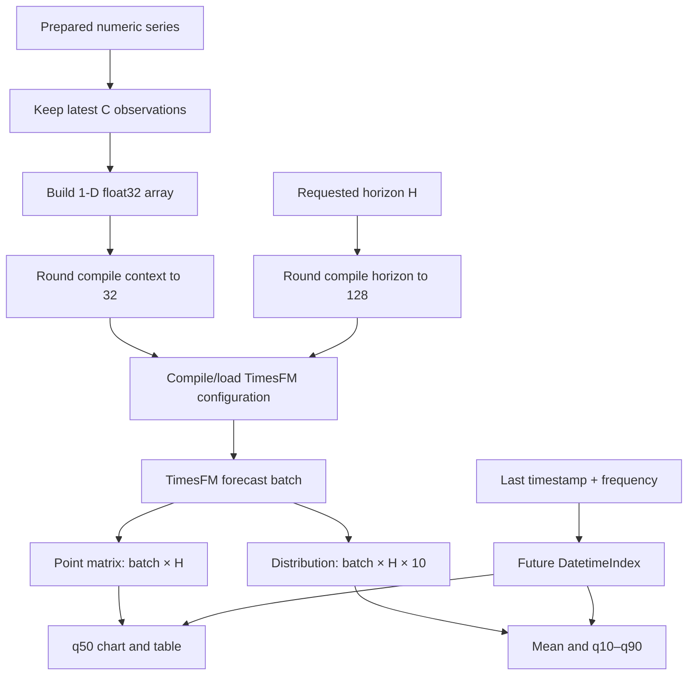
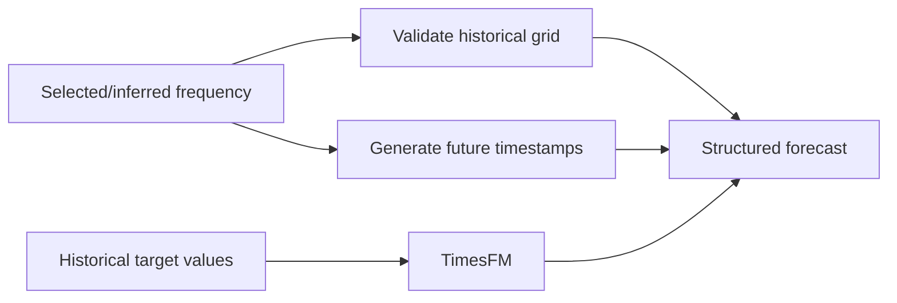
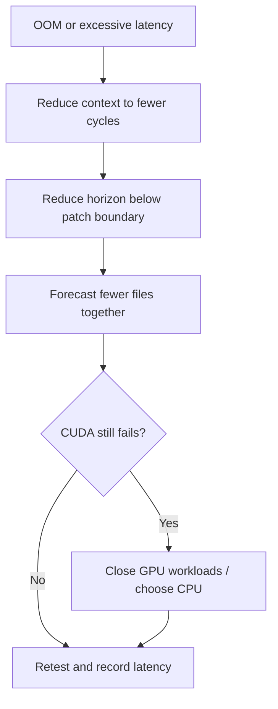
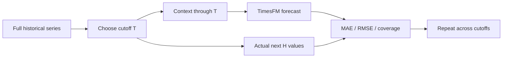

# TimesFM Zero to Master — 4. Forecasting Mastery

[← Previous: Data engineering](03_data_engineering.md) · [Tutorial home](../../README.md#zero-to-master-tutorial) · **Part 4 of 4**

This chapter connects model mechanics to every forecasting control in the Streamlit application. You will choose defensible context and horizon values, interpret quantiles, use the interactive chart, and diagnose resource or data failures.

## 1. End-to-end prediction path



The checkpoint is loaded lazily and cached as a Streamlit resource. A process holds one model instance and serializes compilation/inference through a lock.

## 2. Context length

**Context length** \(C\) is the maximum number of recent observations retained. If a file has more than \(C\) rows, older values are excluded. If it has fewer, all usable observations are sent, but at least two are required.

### 2.1 Choosing context by cycles

| Data frequency | Candidate context | Patterns represented |
|---|---:|---|
| Hourly | 168 | One weekly cycle |
| Hourly | 720 | Roughly one month plus several weekly cycles |
| Daily | 365 | One annual cycle |
| Weekly | 104 | Two annual cycles |
| Monthly | 60 | Five annual cycles |

These are starting points, not model requirements. Choose enough context to expose relevant cycles and regimes without drowning recent behavior in stale history.

| Context too short | Context too long |
|---|---|
| Seasonal pattern may be absent | Old regimes may dilute current dynamics |
| Recent anomalies dominate | More compile time and memory |
| Fewer examples of peaks/troughs | Higher OOM risk |

The app warns when context contains fewer than 32 observations because that is less than one full input patch.

## 3. Forecast horizon

**Forecast horizon** \(H\) is the number of future periods requested, from 1 to 1,024. Its calendar meaning depends on the timestamp frequency.

| Frequency | Horizon | Calendar interpretation |
|---|---:|---|
| Hourly | 24 | One day |
| Hourly | 168 | One week |
| Daily | 30 | Approximately one month |
| Weekly | 13 | Approximately one quarter |
| Month-end | 12 | One year |

Longer horizons compound uncertainty. Even when the model returns a narrow interval, do not assume calibration without historical coverage testing.

## 4. Dimension matching and compilation buckets

TimesFM accepts a Python list containing one 1-D numeric array per series:

```python
inputs = [series_a.astype(numpy.float32), series_b.astype(numpy.float32)]
point, distribution = model.forecast(inputs=inputs, horizon=horizon)
```

Arrays may have different context lengths, but every request in an app batch must share the same horizon and non-negative setting. The runtime compiles using the maximum context in that batch.

The application rounds requested dimensions to TimesFM patch boundaries:

\[
C_{\text{compile}}=32\left\lceil\frac{C}{32}\right\rceil,
\qquad
H_{\text{compile}}=128\left\lceil\frac{H}{128}\right\rceil.
\]

It enforces

\[
C_{\text{compile}}+H_{\text{compile}}\le 16{,}384.
\]

Because even horizon 1 compiles to 128, the UI caps selected context at 16,256.

| Requested | Compiled | Consequence |
|---:|---:|---|
| Context 365 | 384 | Rounded to 12 input patches |
| Horizon 24 | 128 | One output patch compiled; 24 returned |
| Horizon 129 | 256 | Crosses an output-patch boundary |
| Context 16,256 + horizon 1 | 16,256 + 128 | Exactly reaches the limit |

> ⚠️ A one-step increase can cross a patch boundary and trigger recompilation with higher memory use. Prefer stable parameter presets during repeated experimentation.

## 5. Frequency and seasonality

In this app frequency controls the **datetime contract**, not a model feature:



TimesFM 2.5 removed the earlier frequency indicator. Selecting hourly, daily, weekly, or monthly does not tell the checkpoint which seasonalities to use. The numeric context must contain sufficient repeated behavior for the model to recognize it. This change is documented in the [official TimesFM repository](https://github.com/google-research/timesfm#timesfm-25).

Calendar-aware pandas aliases preserve semantics. For example, month-end dates remain month-end when the future index is generated.

> ⚠️ Never label weekly observations as daily to obtain daily-looking output. That changes timestamp labels without creating valid daily information.

## 6. Runtime configuration

The runtime constructs a `ForecastConfig` with the rounded dimensions and these production choices:

| Option | Value | Purpose |
|---|---:|---|
| `normalize_inputs` | `True` | Normalize scale before model inference |
| `per_core_batch_size` | `1` | Conservative memory use |
| `use_continuous_quantile_head` | `True` | Produce quantile distribution |
| `force_flip_invariance` | `True` | Stabilize behavior under sign flipping |
| `infer_is_positive` | Per-series UI setting | Constrain series expected to be non-negative |
| `fix_quantile_crossing` | `True` | Preserve ordered quantiles |

The model loads from `google/timesfm-2.5-200m-pytorch` at the revision pinned in `src/timesfm_app/config.py`. `torch_compile` is disabled during checkpoint load for predictable local startup.

## 7. Understanding outputs

For batch size \(B\), TimesFM returns:

| Output | Shape | App use |
|---|---|---|
| Point | \((B,H)\) | q50 forecast path |
| Distribution | \((B,H,10)\) | Mean, q10, q20, …, q90 |

Channel mapping is exact:

| Channel | Column |
|---:|---|
| 0 | Mean |
| 1 | q10 |
| 2 | q20 |
| 3 | q30 |
| 4 | q40 |
| 5 | q50 |
| 6 | q60 |
| 7 | q70 |
| 8 | q80 |
| 9 | q90 |

The runtime rejects unexpected shapes or non-finite outputs rather than displaying misaligned data.

### 7.1 Quantile interpretation

At a future timestamp, q10 is the model's estimate of the 10th predictive percentile and q90 the 90th. The interval width

\[
w_t=\hat y_{0.9,t}-\hat y_{0.1,t}
\]

is a useful uncertainty signal, but empirical calibration must be measured. For a nominal 80% interval, evaluate

\[
\widehat{\operatorname{coverage}}
=\frac{1}{N}\sum_{i=1}^N
\mathbb{1}[y_i\in[\hat y_{0.1,i},\hat y_{0.9,i}]].
\]

Coverage near 0.8 across representative holdouts is evidence of calibration; a single forecast chart is not.

## 8. Interactive forecasting workflow

1. Load and map one or more datasets in **Data Loading**.
2. Set context, horizon, frequency, and device in the sidebar.
3. Mark non-negative series only when negative values are physically or logically impossible.
4. Run forecasting from **Interactive Forecasting Charts**.
5. Select a dataset result and inspect its chart, quality messages, device, latency, and output table.

The Plotly chart contains:

| Visual element | Meaning |
|---|---|
| Gray line | Historical context |
| Blue line and markers | Future q50 forecast |
| Light blue band | q10–q90 interval |
| Shaded future region | Forecast period |
| Unified hover | Values aligned at each timestamp |

Plotly renders interactively through Streamlit, allowing zoom, pan, hover, and image export. See the official [`st.plotly_chart`](https://docs.streamlit.io/develop/api-reference/charts/st.plotly_chart) and [Plotly time-series guide](https://plotly.com/python/time-series/).

> ⚠️ The blue q50 line is not the distribution mean. Skewed predictive distributions can have different mean and median values; both are retained in the result table.

## 9. Manual simulator

The **Manual Simulator** is the shortest path from numbers to a zero-shot forecast. Enter comma- or newline-separated values:

```text
10, 12, 15, 14, 18, 21, 19, 24
```

The parser:

1. Splits on commas and line breaks.
2. Ignores surrounding whitespace and empty tokens.
3. Requires at least two finite numeric values.
4. Reports the position of an invalid token.
5. Converts values to a one-dimensional `float32` array.

The simulator does not invent timestamps. Its chart uses integer positions and the requested horizon. Context is limited to the latest sidebar-selected number of values.

| Input | Result |
|---|---|
| `10, 12, 15` | Valid |
| `10\n12\n15` | Valid |
| `10, missing, 15` | Error at position 2 |
| `10, NaN, 15` | Non-finite value error |
| `10` | Requires at least two values |

## 10. Practical parameter recipes

### Hourly traffic

| Setting | Starting value | Reason |
|---|---:|---|
| Context | 672 | Four weekly cycles |
| Horizon | 24 or 168 | One day or one week |
| Frequency | Hourly | Preserves hourly future grid |
| Non-negative | Yes | Traffic counts cannot be negative |

### Daily demand

| Setting | Starting value | Reason |
|---|---:|---|
| Context | 730 | Two annual cycles if available |
| Horizon | 30 or 90 | Monthly/quarterly planning |
| Frequency | Daily | Daily future index |
| Non-negative | Usually yes | Confirm target semantics first |

### Monthly revenue

| Setting | Starting value | Reason |
|---|---:|---|
| Context | 60–120 | Five to ten annual cycles |
| Horizon | 12 | One year |
| Frequency | Month-end/month-start matching source | Preserves calendar convention |
| Non-negative | Domain-dependent | Returns/refunds may permit negatives |

These recipes expose cycles but do not replace backtesting. Compare nearby context values and evaluate stability.

## 11. Performance and OOM control



| Lever | Memory effect | Forecast tradeoff |
|---|---|---|
| Shorter context | Lower | May remove useful cycles |
| Shorter horizon | Lower, especially across 128-step boundary | Less future coverage |
| Smaller batch | Lower | More sequential runs |
| CPU device | Removes GPU-memory constraint | Slower, consumes host RAM |

> ⚠️ Do not respond to OOM by silently truncating source data outside the selected context. Make parameter changes explicit so forecasts remain reproducible.

## 12. Evaluation before production

The app is a forecasting simulator, not a backtesting system. A defensible evaluation uses historical cutoffs:



Useful metrics include

\[
\operatorname{MAE}=\frac{1}{N}\sum_i|y_i-\hat y_i|,
\qquad
\operatorname{RMSE}=\sqrt{\frac{1}{N}\sum_i(y_i-\hat y_i)^2}.
\]

Compare against at least a last-value baseline and, for seasonal data, a seasonal-naive baseline \(\hat y_t=y_{t-s}\). Evaluate interval coverage separately from point accuracy.

## 13. Failure matrix

| Failure | Why it happens | Resolution |
|---|---|---|
| Rounded context plus horizon exceeds 16,384 | Compile buckets violate model limit | Reduce context or horizon |
| CUDA requested but unavailable | No compatible runtime device | Select Auto/CPU or repair CUDA stack |
| Batch must share horizon/non-negative setting | Requests are incompatible | Run as separate groups |
| Invalid point/distribution shape | Model/API contract mismatch | Confirm pinned model/package and clear incompatible cache |
| Non-finite forecast | Runtime output validation failed | Inspect input scale/missingness; retain error details |
| Forecast recompiles repeatedly | Parameters cross compile buckets or positivity changes | Reuse stable presets |
| Wide or implausible interval | Uncertain/out-of-domain context | Validate data and compare baselines; do not suppress band |

## 14. Mastery checklist

| Skill | You can now… |
|---|---|
| Context design | Relate observations to repeated cycles and regime relevance |
| Horizon design | Translate future steps into calendar/business meaning |
| Frequency | Explain validation/indexing versus model seasonality |
| Tensor contract | State the 1-D inputs and `(batch, horizon, 10)` output |
| Uncertainty | Distinguish q50, mean, interval width, and empirical coverage |
| Operations | Diagnose cache, CUDA, recompilation, and OOM failures |
| Validation | Design rolling holdouts and baseline comparisons |

## References

- Google Research, [TimesFM repository, model API, and TimesFM 2.5 configuration](https://github.com/google-research/timesfm).
- Das et al., [*A Decoder-only Foundation Model for Time-series Forecasting*](https://arxiv.org/abs/2310.10688).
- Streamlit, [`st.plotly_chart`](https://docs.streamlit.io/develop/api-reference/charts/st.plotly_chart) and [resource caching](https://docs.streamlit.io/develop/api-reference/caching-and-state/st.cache_resource).
- Plotly, [time-series charts](https://plotly.com/python/time-series/).
- pandas, [time-series and date-offset functionality](https://pandas.pydata.org/docs/user_guide/timeseries.html).

[← Previous: Data engineering](03_data_engineering.md) · [Back to repository home](../../README.md)
