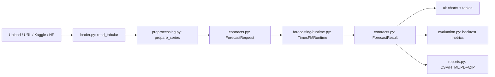

# TimesFM Forecast Studio — the complete guide (zero to hero)

One document, start to finish: what this app is, why it exists, how to get it running on your own machine, and how to use every single feature — written so it makes sense whether you've never touched a forecasting tool before or you're a developer who wants to know exactly what happens under the hood.

> This guide complements, but doesn't replace, the deeper [Zero-to-Master tutorial](tutorial/01_timesfm_intro.md) (four chapters with full math) and the [README](../README.md) (quick reference tables). Read this one first if you want the full story in one place.

## Table of contents

1. [What is this, and why should you care?](#1-what-is-this-and-why-should-you-care)
2. [Core ideas, explained simply](#2-core-ideas-explained-simply)
3. [Clone, set up, and run it](#3-clone-set-up-and-run-it)
4. [A tour of the app, feature by feature](#4-a-tour-of-the-app-feature-by-feature)
5. [How it works under the hood (technical deep dive)](#5-how-it-works-under-the-hood-technical-deep-dive)
6. [Glossary](#6-glossary)
7. [Troubleshooting and FAQ](#7-troubleshooting-and-faq)

---

## 1. What is this, and why should you care?

**In one sentence:** TimesFM Forecast Studio is a point-and-click app that predicts future values in a time series (sales, demand, sensor readings, traffic — anything measured repeatedly over time) using Google's TimesFM 2.5 model, without you having to train, tune, or code anything.

### Why this matters (business perspective)

Traditionally, forecasting a new time series meant one of two things:
- Hiring a data scientist to fit a statistical model (ARIMA, Prophet) or a neural network to *your specific data*, which takes time and expertise, and has to be redone whenever you have a new series.
- Or eyeballing a spreadsheet trendline and hoping for the best.

TimesFM changes that. It's a **foundation model** — like a large language model, but trained to understand the shape of time series instead of language — pretrained once by Google on a huge variety of time series data. Because of that pretraining, it can look at a series it has *never seen before* and produce a reasonable forecast immediately. No training step, no waiting, no machine learning team required. This is called **zero-shot forecasting**.

This app wraps that model in a simple web interface so anyone — analyst, product manager, engineer, student — can:
- Drop in a spreadsheet of historical numbers (sales, energy usage, page views, whatever you track over time).
- Get a forecast in seconds, with a clear best-guess line *and* an honest uncertainty range (it tells you "it'll probably be between X and Y," not just one number pretending to be certain).
- Check whether the forecast is actually any good, using built-in backtesting and accuracy metrics — before anyone bets a business decision on it.
- Export a shareable report (PDF, HTML, CSV) for stakeholders who never open the app themselves.

### What it is not

- It is **not** a guarantee. A pretrained model making a zero-shot guess about your data is a starting point, not a certified forecast. The app itself displays this warning, and this guide repeats it: always compare the forecast against a simple baseline and real outcomes before relying on it for money, safety, or policy decisions.
- It does **not** train or fine-tune anything on your data. Your data never changes the model's weights; it's only used as the "recent context" the model reads before predicting what comes next.
- It runs **locally on your machine** (or a server you control) — your data is not uploaded to a third-party forecasting SaaS. The only network calls are the ones *you* trigger: downloading the model checkpoint from Hugging Face once, and optionally fetching a dataset from a public URL, Kaggle, or Hugging Face Hub.

### Who this is for

| You are... | You get... |
|---|---|
| A business/product person with a spreadsheet of historical numbers | A forecast and a plain chart, no coding required |
| An analyst who needs to justify a forecast | Backtesting, accuracy metrics, and a shareable PDF/HTML report |
| A developer integrating forecasting into a workflow | A clean, tested Python codebase you can read, extend, or lift functions from |
| A student learning about time-series foundation models | A working, inspectable example plus the linked theory tutorial |

---

## 2. Core ideas, explained simply

You don't need a statistics degree to use this app, but a few concepts explain *why* the screens are laid out the way they are.

### Time series, context, and horizon

A **time series** is just numbers measured over time in order — yesterday's temperature, last month's revenue, this hour's server load. Two numbers matter when forecasting:

- **Context**: how much history you show the model before asking for a prediction. More context usually means the model has more pattern to work with, but there's a limit (see below).
- **Horizon**: how far into the future you want predictions — the next 24 hours, the next 12 months, etc.

### Frequency (and a common misconception)

**Frequency** is how often you take a measurement — hourly, daily, weekly, monthly. In this app, frequency does two jobs only: it checks that your timestamps are evenly spaced (no gaps, no random jumps), and it labels the future dates on the chart. It is **not** fed into the model as a "this is hourly data" signal — TimesFM 2.5 figures out any repeating pattern from the numbers themselves. If your data has a weekly cycle, the model has to see that cycle in the actual values, not in a metadata flag.

### Zero-shot forecasting, in one analogy

Think of a foundation model like an experienced consultant who has seen thousands of businesses' sales charts before. Show them your chart for the first time, and they can say "this looks like it's trending up with a weekly dip on weekends" — without ever having worked for your company. That's zero-shot: no training on *your* data, just pattern recognition from broad prior experience. **Fine-tuning**, by contrast, would be like hiring that consultant full-time for months until they specialize in only your business — this app doesn't do that; it always uses the same pretrained, unmodified checkpoint.

### Point forecast vs. quantile forecast (the uncertainty band)

Every forecast in this app gives you two things, not one:

- A **point forecast** (labeled q50, the median) — the single best-guess line.
- A **quantile forecast** — a range of plausible outcomes at different confidence levels (q10 through q90). The shaded band on every chart is the gap between the 10th and 90th percentile guesses: the model's honest way of saying "I'm not 100% sure, but I'm fairly confident the real value lands somewhere in this shaded zone."

Wider bands mean more uncertainty; narrower bands mean the model is more confident. Trusting the point line alone and ignoring the band is a common (and risky) mistake.

### Patching (why there are size limits)

Feeding a model one number at a time for a year of hourly data would be enormously expensive to compute. TimesFM instead groups consecutive values into **patches** — chunks of 32 numbers on the input side, 128 on the output side — and reasons over patches rather than individual points. That's why the app rounds your chosen context/horizon up to the nearest patch boundary, and why there's a combined size ceiling (rounded context + horizon ≤ 16,384 points). You don't need to manage this yourself — the app does the rounding for you — but it explains why an odd context length like "500" silently becomes "512" internally.

For the full mathematical treatment (patch equations, the pinball loss behind quantile forecasts, zero-shot transfer formalized, and a detailed model comparison against ARIMA/Prophet/DeepAR), read [tutorial chapter 1](tutorial/01_timesfm_intro.md).

---

## 3. Clone, set up, and run it

### What you need first

- **Git**, to clone the repository.
- **[uv](https://docs.astral.sh/uv/)** — the Python package/environment manager this project is built around. (A pip-compatible `requirements.txt` is also provided if you'd rather use a plain virtual environment.)
- **Python 3.14** (uv can install this for you — see below).
- Enough disk space and RAM for PyTorch and the TimesFM checkpoint (a few GB). A GPU (NVIDIA CUDA) is optional — the app runs fine on CPU, just slower per forecast.

### Clone the repository

```powershell
git clone https://github.com/pypi-ahmad/timesfm-forecasting-studio.git
Set-Location timesfm-forecasting-studio
```

### Set up the environment (recommended: uv)

```powershell
uv python install 3.14
uv sync --locked --group dev
```

`uv sync --locked` reads the committed `uv.lock` file and installs *exactly* the pinned versions — this is what makes the setup reproducible across machines. `--group dev` also pulls in test/lint tooling (pytest, ruff), which you'll want if you plan to touch the code.

**Alternative: plain pip + venv**, if you don't want to install `uv`:

```powershell
py -3.14 -m venv .venv
.\.venv\Scripts\Activate.ps1
python -m pip install -r requirements.txt
```

The lockfile pins the CUDA build of PyTorch by default. If you're on a CPU-only machine or hit installation issues, read [tutorial chapter 2](tutorial/02_local_installation.md) before changing the pinned PyTorch source — it walks through uv/venv/Conda setup, GPU-vs-CPU selection, and credential setup in full.

### Configure credentials (optional, only if you need them)

Only needed if you plan to use the Kaggle or Hugging Face dataset-search features, or a gated/private Hugging Face model. Copy the example secrets file and fill in what you use:

```powershell
Copy-Item .streamlit/secrets.toml.example .streamlit/secrets.toml
```

Then edit `.streamlit/secrets.toml` (this file is gitignored — it will never be committed) and set whichever of these apply:

| Purpose | Key |
|---|---|
| Hugging Face access token | `HF_TOKEN` |
| Kaggle (current-style token) | `KAGGLE_API_TOKEN` |
| Kaggle (legacy username/key) | `KAGGLE_USERNAME`, `KAGGLE_KEY` |
| Change where local files/models are cached | `TIMESFM_APP_CACHE` |
| Force offline mode (use only what's already cached) | `TIMESFM_OFFLINE=true` |

Environment variables work the same way as secrets and take priority — either approach is fine. If you skip this entirely, Upload and Public URL loading still work with no credentials at all.

### Run the app

```powershell
uv run streamlit run app.py
```

(or, if you used the plain-venv path: `streamlit run app.py`)

Streamlit prints a local URL (typically `http://localhost:8501`) — open it in your browser. The first time you run a forecast, the app downloads the TimesFM checkpoint from Hugging Face (a few hundred MB) and caches it under `.cache/huggingface`; every forecast after that reuses the cached copy, and you can go fully offline (`TIMESFM_OFFLINE=true`) once it's cached.

### Verify everything works (optional but recommended)

```powershell
uv run pytest
```

This runs the full unit and integration test suite — a green run confirms your environment is set up correctly before you start relying on the app.

### Why use this instead of writing your own script?

You *could* call the TimesFM Python library directly in a notebook. This app exists for everyone who doesn't want to write that plumbing themselves: it already handles reading messy spreadsheets, validating that your timestamps are actually regular, safely fetching data from the internet without exposing your machine to obvious attacks, batching multiple files together, comparing forecast accuracy against held-out data, and producing a polished report — all steps that are easy to get subtly wrong by hand.

---

## 4. A tour of the app, feature by feature

When the app opens, you'll see a **sidebar** (always visible) and a **workflow stage selector** across the top (Load & configure → Analyze → Forecast → Evaluate & anomalies → Export). There's also a **Manual simulator** toggle in the sidebar for quick, no-file forecasts. Here's every control, explained.

### The sidebar (always visible)

| Control | What it does | Plain-language advice |
|---|---|---|
| **Compute device** (auto / cpu / cuda) | Chooses what hardware runs the model | Leave on "auto" unless you know you have a working NVIDIA GPU and want to force CPU for testing |
| **Context length** | How much history to feed the model (2 up to your data's max, capped at 16,256) | More history usually helps, but very long context takes longer to compute; start around 512–1,024 and adjust |
| **Forecast horizon** | How many future steps to predict (1–1,024) | Match this to what you actually need to act on — forecasting 1,000 steps when you only care about the next 7 days just adds noise and compute time |
| **Frequency** | Auto, or force hourly/daily/weekly/month-start/month-end/quarterly/yearly | Leave on "Auto" unless the app can't infer it from your timestamps |
| **API configuration captions** | Shows whether Kaggle/Hugging Face credentials were detected, and which model checkpoint is pinned | Read-only status; edit `.streamlit/secrets.toml` or environment variables to change it |

### Stage 1 — Load & configure

Pick a data source from four tabs:

**Upload.** Drag in one or more CSV, Parquet, or XLSX files directly from your computer. Each file is validated (correct file extension, correct magic-byte signature so a renamed file can't sneak in as something it isn't), size-capped, and stored in a local content-addressed cache (named by the file's SHA-256 hash, so the same file is never downloaded/stored twice).

**Public URL.** Paste a direct link to a CSV/Parquet/XLSX file on the public internet and click Download. Behind the scenes, the app checks that the URL only points at genuinely public internet addresses — it deliberately refuses to fetch anything on your own private network (localhost, internal IP ranges, cloud-metadata addresses), even if a redirect tries to sneak one in. This exists purely to protect *you*: without it, a malicious link could otherwise trick your own app into probing machines on your local network. You don't need to do anything to benefit from this — it's automatic.

**Kaggle.** Search Kaggle's public dataset catalog by keyword (requires the Kaggle credentials from step 3), pick a result, and download it. If the dataset contains multiple tabular files, you'll get to choose which one to use.

**Hugging Face.** Search Hugging Face's dataset hub, list the files inside a chosen dataset repository, and download the one you want (an access token is optional unless the dataset is gated/private).

Every dataset you load appears in an **inventory table** at the bottom of this stage — name, source, size, and a short hash so you can tell files apart even with duplicate names. A **Clear loaded datasets** button resets your working session (loaded files, forecasts, analysis results) without touching the on-disk cache, so re-loading the same file later is instant.

### Stage 2 — Analyze (exploratory data analysis)

Pick which loaded dataset, which date/time column, and which numeric column to treat as the target, plus a **seasonal period** (how many steps make up one repeating cycle — e.g. 24 for hourly data with a daily cycle, 7 for daily data with a weekly cycle; the app guesses a sensible default from your frequency). You'll then see:

| Chart / stat | What it tells you, in plain terms |
|---|---|
| Summary metrics (count, missing, mean, std, median, IQR) | The basic shape of your numbers — how many points, how spread out, any gaps |
| Trend and rolling mean | Your raw series plus a smoothed line, so you can see the trend without the noise |
| Distribution + box plot | How your values are spread — clustered tightly, or with a long tail of extreme values |
| Empirical cumulative distribution (ECDF) | What fraction of your data falls below any given value — useful for "what's a typical vs. an unusual reading" questions |
| Seasonal profile | Average value at each position in the cycle (e.g. average for "hour 3 of the day") — reveals a repeating pattern if one exists |
| Autocorrelation (ACF) | How strongly a value is related to earlier values at various lags — spikes tell you where the repeating structure is |
| STL decomposition | Splits your series into trend, seasonal, and leftover ("residual") components, so you can see each influence separately |
| Outliers (robust z-score) | Flags points that are unusually far from the typical value, using a method that isn't thrown off by a few extreme outliers itself |

This stage is entirely optional but genuinely useful before forecasting — it tells you whether your data actually *has* a seasonal pattern for the model to pick up on, and whether there are data-quality problems worth fixing first.

### Stage 3 — Forecast

For each loaded dataset, you'll map its columns (date/time column, numeric target, whether the target can go negative) and choose an approach:

- **Standard TimesFM** — the default. Uses only the historical values of your target column.
- **TimesFM + XReg covariates** — an advanced mode for when you have *other* known columns that might help explain the target (e.g. a promotional-flag column, temperature readings, a categorical "is holiday" column) and you know their *future* values too (or can supply blank placeholder rows for the model to fill in via the linear XReg component). To use it: leave the future rows of your target column blank for the horizon you want, keep the covariate columns filled in through that same future horizon, and pick which columns are numerical vs. categorical covariates. There are two blending modes ("xreg + timesfm" vs. "timesfm + xreg") controlling which component leads.

Click **Forecast all datasets** to run everything in one batch — datasets sharing the same horizon and positivity setting are forecast together for efficiency; anything that fails gets an individual retry so one bad file doesn't sink the rest. Each result shows an interactive chart (history, shaded uncertainty band, and the point forecast) and a full table of every quantile (q10 through q90) alongside the point/mean forecast.

### Stage 4 — Evaluate & anomalies

This is where you check whether the forecast is actually trustworthy, using **rolling-origin backtesting**: the app repeatedly pretends it's at an earlier point in your history, forecasts forward, and compares that forecast against what *actually* happened (which you already have, since it's history). Choose how many such backtest windows to run (1–10) and click **Run rolling backtest**. You'll get:

| Metric | Plain-language meaning |
|---|---|
| MAE (mean absolute error) | On average, how far off the point forecast was, in your original units |
| RMSE (root mean squared error) | Like MAE, but penalizes big misses more heavily |
| Bias | Whether the model systematically over- or under-predicts |
| sMAPE / WAPE | Error expressed as a percentage, so you can compare across series with different scales |
| MASE / RMSSE | Error compared against a naive "just repeat the last value" baseline — below 1 means TimesFM beat the naive guess |
| Pinball loss / mean WQL | How good the *uncertainty band* is, not just the point guess — rewards a band that's honest about its confidence |
| Coverage (10–90) | What fraction of actual values really did fall inside the predicted q10–q90 band (should be close to 80%) |
| Winkler score | A single number that penalizes both an overly wide band *and* actual values that fall outside it |

Below the metrics, an **anomaly table** flags any actual values that fell *outside* the predicted q10–q90 band, with a severity score showing how far outside. This is a practical way to catch unusual events (a spike, an outage, a data error) after the fact.

### Stage 5 — Export

Once you have a forecast (and optionally analysis/backtest results), download:

- **Forecast CSV** — just the numbers.
- **Interactive HTML** — a self-contained report with live Plotly charts, viewable in any browser, shareable with someone who has never opened this app.
- **PDF report** — a static, printable version with the same tables and a forecast chart.
- **Complete ZIP** — all of the above plus a `manifest.json` recording exactly which dataset, model, model revision, and compute device produced the results — useful for reproducibility and audit trails.

### Manual simulator (sidebar toggle)

No file needed. Paste a comma- or newline-separated list of numbers directly into a text box, set a horizon, and forecast immediately. Useful for quick "what would TimesFM say about this sequence" experiments, teaching, or sanity-checking the model's behavior without preparing a spreadsheet first.

---

## 5. How it works under the hood (technical deep dive)

This section is for developers who want to read, extend, or trust the codebase. Everything above is a black box; this is what's inside it.

### Project layout

```text
app.py                             entry point — calls render_app()
src/loader.py                      stable facade: load a file or URL into a validated DataFrame
src/integrations.py                Kaggle and Hugging Face search/download clients
src/predictor.py                   device-aware, Pandas-in/Pandas-out forecasting facade
src/timesfm_app/
  config.py                       AppSettings — reads env vars / st.secrets, pins model revision
  contracts.py                    frozen dataclasses defining every boundary: ForecastRequest,
                                   ForecastResult, SeriesSpec, ResolvedAsset, DataQualityReport...
  ingestion/
    readers.py                    CSV / Parquet / XLSX parsing
    resolvers.py                  upload caching + SSRF-hardened public-URL download
    providers.py                  Kaggle / Hugging Face file resolution
  forecasting/
    preprocessing.py              turns a raw DataFrame + column choice into a validated series
    runtime.py                    TimesFMRuntime — loads the checkpoint, compiles, runs inference
  analysis.py                     exploratory data analysis (trend, ACF, STL, outliers...)
  evaluation.py                   rolling-origin backtesting and accuracy metrics
  manual_datasets.py              bundled example dataset builders (FRED, NOAA, UCI, NYC TLC)
  reports.py                      CSV / HTML / PDF / ZIP report generation
  ui/                              Streamlit pages, one file per screen/concern
tests/
  unit/                            one test file per module above
  integration/                     model-free Streamlit smoke tests
```

### The data flow, end to end



1. **Ingestion** (`ingestion/resolvers.py`, `ingestion/providers.py`) turns "a file, a URL, or a dataset handle" into a `ResolvedAsset` — a content-hashed, validated path on local disk. This is the only layer that touches the network or untrusted bytes, and it's the most defensively written part of the codebase (see the security note below).
2. **Preprocessing** (`forecasting/preprocessing.py::prepare_series`) takes a raw `DataFrame` plus your chosen date/target columns and produces a `PreparedSeries`: a clean, gap-checked, regularly-spaced `float32` array plus a `DataQualityReport` describing what was trimmed or flagged along the way. This is where "duplicate timestamps," "irregular spacing," and "trailing missing values" get rejected outright, while leading gaps get trimmed and internal gaps get reported (TimesFM interpolates small internal gaps itself).
3. **Contracts** (`contracts.py`) are frozen dataclasses that validate themselves in `__post_init__` — e.g. `ForecastRequest` computes and validates the patch-rounded `compile_context`/`compile_horizon` the moment it's constructed, so an invalid request can never reach the model layer at all.
4. **Runtime** (`forecasting/runtime.py::TimesFMRuntime`) lazily loads the pinned TimesFM checkpoint on first use, recompiles only when the rounded context/horizon/positivity combination actually changes (an expensive step you want to avoid repeating), and serializes access with a lock since PyTorch models aren't safely called from multiple threads at once. `predictor.py::TimesFMPredictor` wraps this in a simpler, Pandas-oriented facade used by most of the UI.
5. **Evaluation** (`evaluation.py`) implements rolling-origin backtesting from scratch on top of the same `TimesFMRuntime.forecast` call — no separate evaluation library, just repeated calls against held-out windows.
6. **UI** (`ui/*.py`) is a thin Streamlit layer: each file owns one screen or concern (`workbench_page.py` orchestrates the five-stage flow, `charts.py` builds the Plotly figure, `results.py` builds the results table, `state.py` centralizes session-state cleanup). Business logic deliberately stays out of this layer — UI files call into `contracts`/`forecasting`/`evaluation`, never the other way around.

### A security-relevant detail worth knowing

The public-URL download path (`ingestion/resolvers.py::download_public_url`) is the one place this app accepts a URL you type in and fetches it. It: only allows `http`/`https`, rejects URLs with embedded credentials, resolves the hostname and rejects private/loopback/link-local/reserved IP ranges, re-validates on every redirect hop (up to 4), pins the actual network connection to the address it just validated (closing a DNS-rebinding timing gap), caps downloads at 200 MiB, and checks both the file extension and the first few bytes ("magic bytes") before treating a download as real Parquet/XLSX data. None of this requires you to do anything — it's automatic — but it's worth knowing this exists if you're evaluating the app for use in your own environment. A full attacker-model writeup lives in `timesfm-forecasting-studio-threat-model.md` at the repository root.

### Testing

```powershell
uv run pytest              # full unit + integration suite
uv run ruff check src tests app.py       # lint
uv run ruff format --check src tests app.py   # formatting check
```

Unit tests mirror the module layout (`tests/unit/test_ingestion.py`, `test_forecasting.py`, `test_evaluation.py`, etc.) and use fakes/mocks for the actual TimesFM model so the suite runs fast without downloading a checkpoint. Integration tests exercise the Streamlit app itself without requiring the model, confirming the UI wiring holds together.

---

## 6. Glossary

| Term | Meaning |
|---|---|
| **Time series** | A sequence of values measured in order over time |
| **Context** | The historical values you feed the model before asking for a forecast |
| **Horizon** | How many future steps you're asking the model to predict |
| **Frequency** | The spacing of your timestamps (hourly, daily, ...) — used to validate regularity and label future dates, not fed to the model as a signal |
| **Zero-shot forecasting** | Predicting on data the model was never specifically trained on, using only its general pretrained knowledge |
| **Foundation model** | A model pretrained broadly and reused across many tasks/datasets without retraining |
| **Point forecast (q50)** | The single best-guess predicted value — the median of the model's distribution |
| **Quantile forecast** | A predicted value at a given confidence level (e.g. q10 = "only 10% chance the real value is lower than this") |
| **Patching** | Grouping consecutive values into fixed-size chunks (32 in, 128 out) so the model can process long histories efficiently |
| **XReg / covariates** | Extra known columns (besides the target) that may help explain or adjust the forecast |
| **Rolling-origin backtest** | Repeatedly forecasting from earlier points in known history and comparing against what actually happened, to measure accuracy honestly |
| **MAE / RMSE / sMAPE / WAPE / MASE / RMSSE** | Different ways of scoring how close the point forecast was to reality |
| **Pinball loss / WQL / coverage / Winkler score** | Ways of scoring how good the *uncertainty band* was, not just the point guess |
| **SSRF (Server-Side Request Forgery)** | An attack where a server is tricked into fetching an internal/private address instead of the intended public one; this app has hardening specifically against it on the public-URL feature |
| **Content-addressed cache** | Storing a file under a name derived from its own content hash, so identical files are never duplicated and tampering is detectable |

---

## 7. Troubleshooting and FAQ

**"Could not infer a regular frequency" / "Timestamps are not regular"** — Your date column has gaps or irregular spacing at the frequency the app guessed. Pick an explicit frequency in the sidebar, or clean up your source data so timestamps are evenly spaced.

**"Rounded context plus horizon exceeds TimesFM limit of 16,384 points"** — You asked for a combination of context + horizon that, after rounding to patch boundaries, is too large for the model. Reduce context length or horizon.

**Forecast is slow the first time** — The first forecast in a session downloads and loads the model checkpoint (and compiles it for your chosen context/horizon). Subsequent forecasts with the same rounded context/horizon/positivity reuse the compiled model and are much faster.

**"CUDA was requested but is unavailable"** — You selected `cuda` as the compute device but no working NVIDIA GPU/driver was detected. Switch to `auto` or `cpu`.

**Kaggle/Hugging Face search says "not configured"** — You haven't set the relevant credentials. See [section 3](#configure-credentials-optional-only-if-you-need-them) — Upload and Public URL work with no credentials at all if you don't need those sources.

**"URL resolves to a private or otherwise unsafe address"** — The app deliberately refuses to fetch that address; see the security note in [section 5](#a-security-relevant-detail-worth-knowing). This isn't a bug — the URL you gave it points at a private/internal network address, which the app will never fetch.

**Why is my forecast confidently wrong?** — Zero-shot means no training on your specific series. Check the seasonal period and context length on the Analyze stage, run a rolling backtest before trusting the numbers, and compare against a naive baseline (MASE/RMSSE below 1 means TimesFM is beating "just repeat the last value").

---

*Questions this guide doesn't answer, or feedback on it? See [CONTRIBUTING.md](../CONTRIBUTING.md) and [SUPPORT.md](../SUPPORT.md).*
