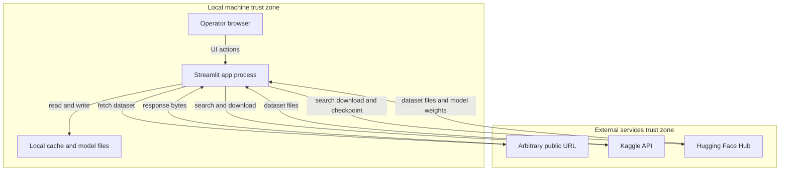

# Threat Model: timesfm-forecasting-studio

## Executive summary

This is a single-user, local-desktop Streamlit application for zero-shot time-series forecasting with Google TimesFM 2.5, confirmed by the user to run only on the operator's own machine against public/synthetic data — not a hosted multi-tenant service. Given that context, overall risk is **low**. The one finding worth active attention is a **DNS-rebinding TOCTOU gap** in the public-URL SSRF guard (`src/timesfm_app/ingestion/resolvers.py`): the guard resolves and validates the hostname once, then `httpx` independently re-resolves DNS at connect time, so an attacker who controls DNS for a domain they get the operator to paste as a "dataset URL" could rebind to a private/internal address after validation passes. Remaining findings (CSV formula-injection in exported reports, latent zip-slip pattern, unpinned model revision override) are low-priority and mostly conditional on future code changes or deliberate operator misconfiguration rather than a currently reachable attacker path.

## Scope and assumptions

**In-scope paths:** `src/timesfm_app/**`, `src/integrations.py`, `src/loader.py`, `src/predictor.py`.
**Out-of-scope:** CI/build tooling (`.github/**`), tests, docs, `graphify-out/` (generated artifacts, not application logic), the upstream `timesfm`/`torch`/`huggingface_hub`/`kagglehub` library internals (third-party dependency code, not this repo).

**Assumptions (confirmed with user):**
- Deployment model: local desktop only — each operator runs `streamlit run` on their own machine. No network exposure beyond localhost.
- The public-URL dataset ingestion feature is reachable only by the trusted local operator, not by an untrusted remote party directly.
- Data handled is public/synthetic time-series data only — no PII or regulated/internal data confirmed in scope.
- No authentication/session boundary exists anywhere in the app (Streamlit has none built-in) — by design, since it's single-user.
- `model_id`/`model_revision` are operator-set config values (env/`st.secrets`), pinned by default to a specific commit SHA (`config.py:12`), not attacker-controlled at runtime.

**Open questions that would raise priority if answered differently:**
- If this app is ever deployed as a shared/hosted instance (Streamlit Cloud, internal server), every finding here should be re-scored upward — in particular the no-auth model becomes a direct multi-tenant data/credential exposure risk, and the SSRF gap becomes remotely triggerable by any user of the shared instance.
- Whether exported reports (CSV/XLSX/PDF) are ever shared with or opened by a second party (colleague, client) — this changes TM-002's blast radius from "operator's own machine" to "downstream reader's machine."

## System model

### Primary components
- **Streamlit UI** (`src/timesfm_app/ui/*`) — `render_app` entrypoint; pages for loading, dataset forecasting, quick/manual forecasting, workbench (analysis/evaluation/export).
- **Ingestion layer** (`src/timesfm_app/ingestion/resolvers.py`, `providers.py`, `readers.py`) — upload caching, public-URL download with SSRF guard, Kaggle/HF file resolution.
- **Integrations facade** (`src/integrations.py`) — `KaggleDatasetClient`, `HuggingFaceDatasetClient` search/download, credential-aware.
- **Config** (`src/timesfm_app/config.py`) — `AppSettings.from_environment`, loads `HF_TOKEN`/`KAGGLE_*` from env or `st.secrets`.
- **Domain/forecast core** (`contracts.py`, `analysis.py`, `evaluation.py`, `manual_datasets.py`, `forecasting/preprocessing.py`, `forecasting/runtime.py`) — series prep, TimesFM model invocation via `TimesFMRuntime`.
- **Reports** (`reports.py`) — CSV/HTML/PDF export of results.
- **Local cache/model store** — `AppSettings.cache_root` (`.cache/data`, `.cache/huggingface`).

### Data flows and trust boundaries
- Operator Browser → Streamlit App (same machine, localhost) — UI actions, no network boundary crossed.
- Streamlit App → Arbitrary Public URL (`download_public_url`, `resolvers.py:76`) — HTTP/HTTPS, no auth; validated against private/loopback/link-local/reserved IP ranges per-hostname-resolution (`validate_public_url`, `resolvers.py:43`), re-checked on every redirect hop (up to 4), 200MB size cap enforced during streaming.
- Streamlit App → Kaggle API (`KaggleDatasetClient`) — HTTPS, authenticated via `KAGGLE_API_TOKEN`/`KAGGLE_USERNAME`+`KAGGLE_KEY` env vars set by the operator.
- Streamlit App → Hugging Face Hub (`HuggingFaceDatasetClient`, `resolve_huggingface_file`, model `from_pretrained`) — HTTPS, optional `HF_TOKEN`; model revision pinned by default.
- Streamlit App → Local filesystem cache — uploaded files, downloaded datasets, model checkpoints; filenames/suffixes validated (`_validate_filename`, `_validate_signature`) before caching.

#### Diagram

## Assets and security objectives

| Asset | Why it matters | Security objective (C/I/A) |
|---|---|---|
| `HF_TOKEN` / `KAGGLE_API_TOKEN` / `KAGGLE_USERNAME` / `KAGGLE_KEY` (env, `st.secrets`) | Grant access to the operator's HF/Kaggle account; leakage enables account abuse | C |
| Local dataset cache (`.cache/data/{uploads,urls}`) | Holds third-party and operator-supplied data being worked on | C |
| TimesFM model checkpoint (`.cache/huggingface`) | Forecast correctness depends on unmodified, trusted weights | I |
| Exported reports (CSV/HTML/PDF via `reports.py`) | May be shared onward; must not carry unintended payloads (formula/script injection) | I |
| Operator's local/LAN network reachability | Potential SSRF pivot point if the URL guard is bypassed | C, I |

## Attacker model

### Capabilities
- Can send the operator a link to a dataset hosted on attacker-controlled infrastructure/DNS, hoping the operator pastes it into the "Public URL" loader.
- Can control DNS resolution (including low-TTL records) for a domain they own, enabling rebinding after the app's initial validation.
- Can publish a malicious dataset file (CSV/XLSX/zip) to Kaggle or Hugging Face that the operator might search for and download.

### Non-capabilities
- Cannot reach the Streamlit process directly over a network — no listener beyond localhost in the confirmed deployment model.
- Cannot control `model_id`/`model_revision` at runtime — these are operator-set config, pinned to a specific commit SHA by default.
- Cannot exploit a multi-tenant/auth boundary — none exists, and none is expected to, given single-user-by-design.
- Cannot directly trigger any code path without the operator taking an action (pasting a URL, searching/selecting a dataset, overriding an env var).

## Entry points and attack surfaces

| Surface | How reached | Trust boundary | Notes | Evidence (repo path / symbol) |
|---|---|---|---|---|
| File upload | Operator selects local file | Local → App | Suffix + magic-byte validated, size-capped, hashed into content-addressed cache | `resolvers.py:24` `cache_uploaded_file`, `_validate_filename`/`_validate_signature` |
| Public URL download | Operator pastes URL | App → Internet | SSRF guard blocks private/loopback/link-local/reserved IPs per resolved hostname; revalidated per redirect hop; DNS resolved independently again at connect time (TOCTOU) | `resolvers.py:43` `validate_public_url`, `resolvers.py:76` `download_public_url` |
| Kaggle search/download | Operator searches, selects result, downloads | App → Kaggle API | Credentials from env; `handle` for download comes from Kaggle's own search result, not raw free text | `integrations.py:32` `KaggleDatasetClient`, `providers.py:18` `resolve_kaggle_dataset` |
| Hugging Face search/download | Operator searches, selects files, downloads | App → HF Hub | Suffix-filtered; token from env; revision resolved via HF API unless offline | `integrations.py:92` `HuggingFaceDatasetClient`, `providers.py:61` `resolve_huggingface_file` |
| Model checkpoint load | App startup (cached resource) | App → HF Hub | `model_revision` pinned by default in config; operator can override via env | `config.py:12`, `runtime.py:174` `_get_model` |
| Zip-bundled manual dataset read | Operator downloads bundled dataset | App (in-memory) | Reads a named member into pandas directly from bytes — no on-disk extraction, so no zip-slip write path today | `manual_datasets.py:173` `_read_zip_csv` |
| Config/secrets load | App startup | Env/`st.secrets` → App | Values marked `repr=False` on the frozen dataclass so they don't appear in reprs/logs by default | `config.py:8` `AppSettings`, `config.py:30` `from_environment` |

## Top abuse paths

1. **DNS-rebinding SSRF via shared link** — Attacker registers a domain with a low-TTL DNS record resolving to a public IP → sends the operator a link ("here's a public dataset") → operator pastes it into the Public URL loader → `validate_public_url` resolves and approves the (currently public) IP → attacker flips the DNS record to a private/loopback address → `httpx.Client.stream` performs its own fresh DNS lookup at connect time and connects to the now-private address → app fetches and displays/stores content from an internal-only endpoint reachable from the operator's machine (impact: recon of local/LAN services; no data leaves the machine to the attacker directly).
2. **CSV/Excel formula injection via third-party dataset** — Operator downloads a public Kaggle/HF dataset containing spreadsheet-formula payloads in cell values → data flows through `manual_datasets`/analysis into an exported report → operator or a downstream colleague opens the exported CSV/XLSX in Excel → embedded formula executes with the opener's local privileges, if the export path doesn't neutralize leading `=`/`+`/`-`/`@` characters (not confirmed either way from evidence gathered — flagged for direct review of `reports.py`).
3. **Redirect-chain SSRF (currently mitigated)** — Attacker-controlled URL 302-redirects through multiple hosts toward a private address → closed today because `validate_public_url` re-runs on every redirect hop inside the loop (`resolvers.py:90`); a regression risk only if that per-hop revalidation is refactored away.
4. **Latent zip-slip pattern** — `_read_zip_csv` opens an archive member by name; no path-traversal risk exists today because the read stays in-memory (`ZipFile.open` → `pd.read_csv`), but the same filename-trust pattern would become a real zip-slip if a future change added on-disk extraction using the raw member name.
5. **Untrusted model revision override** — Operator (or a script run on the operator's behalf) sets `model_id`/`model_revision` env vars to point at an untrusted HF repo/revision, bypassing the safe pinned default → app loads and deserializes that checkpoint via `timesfm`/`torch` → any deserialization weakness in the upstream loading path (outside this repo) would execute in that context.

## Threat model table

| Threat ID | Threat source | Prerequisites | Threat action | Impact | Impacted assets | Existing controls (evidence) | Gaps | Recommended mitigations | Detection ideas | Likelihood | Impact severity | Priority |
|---|---|---|---|---|---|---|---|---|---|---|---|---|
| TM-001 | Attacker who controls DNS for a domain shared with the operator | Operator pastes an attacker-influenced URL into the Public URL loader | Rebind DNS between `validate_public_url`'s resolution and `httpx`'s independent connect-time resolution | App fetches/returns content from a private/internal address reachable from operator's machine | Operator's LAN reachability, local cache content | Private/loopback/link-local/reserved blocklist checked per hostname, re-checked on every redirect hop (`resolvers.py:43-73,90`) | Validation and connection each perform independent DNS lookups — no IP pinning between them | Resolve once and connect directly to the validated IP (custom transport/dest override, preserving Host header for SNI/vhost), or re-validate immediately at socket-connect time | Log when the IP used for connection differs from the IP validated moments earlier | Low | Medium | Medium |
| TM-002 | Malicious third-party dataset publisher (Kaggle/HF/web) | Operator downloads and later exports/re-shares a dataset containing spreadsheet-formula payloads | Formula-laden cell values pass through the report pipeline unmodified into CSV/XLSX/PDF export | Formula executes in Excel with the opener's privileges if exported file is reopened | Exported report files, downstream reader's machine | Not confirmed either way from evidence gathered this session | Unconfirmed whether `reports.py` neutralizes leading `=`/`+`/`-`/`@` in exported cells | Prefix risky leading characters (or use a formula-injection-safe CSV/XLSX writer) in `reports.py` export paths | none currently | Low | Low | Low |
| TM-003 | Malicious archive publisher | Operator downloads a zip-bundled manual dataset with a crafted member name | `_read_zip_csv` opens the member by name | None today — read stays in-memory, no extraction-to-disk path exists | n/a today; would become local filesystem if code changes | Read-only `ZipFile.open` → `pd.read_csv`, no `extractall`/write use (`manual_datasets.py:173-179`) | No forward-looking guard preventing a future write-path from reusing the raw member name | If on-disk extraction is ever added, constrain to `Path(name).name` plus a resolved-path containment check | n/a | Low | Low | Low (latent, no live path) |
| TM-004 | Operator misconfiguration (self-inflicted, not directly attacker-reachable) | Operator overrides `model_id`/`model_revision` env vars away from the pinned default | App loads a torch checkpoint from an untrusted HF repo/revision | Deserialization risk depends on upstream `timesfm`/`torch`/`huggingface_hub` loading internals (out of this repo's scope) | Operator's machine | Default `model_revision` pinned to a specific commit SHA (`config.py:12`); `offline`/`local_files_only` mode available | No verification that an operator-overridden `model_id`/`model_revision` still points to a trusted publisher | Document that `TIMESFM_APP_MODEL_ID`/`_REVISION` overrides must only point to reviewed/trusted checkpoints | n/a | Low | High | Low |

## Criticality calibration

For this repo, given the confirmed local-desktop, single-operator, public-data deployment:

- **Critical** (none currently found): would require a remotely reachable, unauthenticated RCE or auth bypass. Example: if this app were ever hosted as a shared multi-tenant service with the current no-auth model, that absence of auth would itself become critical.
- **High** (none currently found): a live, directly attacker-triggerable path with no operator action required — e.g., the SSRF guard being bypassable on the *first* request (not just via a timing race), or a confirmed on-disk zip-slip write path.
- **Medium**: TM-001 — a real gap in existing hardening that requires the operator to take one action (paste a URL) and the attacker to win a timing race; consistent with "targeted, conditional impact" rather than "trivially, remotely exploitable."
- **Low**: TM-002 through TM-004 — either unconfirmed/latent (no live exploitation path today) or require a deliberate operator misconfiguration rather than any attacker-reachable trigger.

## Focus paths for security review

| Path | Why it matters | Related Threat IDs |
|---|---|---|
| `src/timesfm_app/ingestion/resolvers.py` | SSRF guard implementation; DNS-rebinding TOCTOU gap between validation and connection | TM-001 |
| `src/timesfm_app/reports.py` | CSV/HTML/PDF export — confirm formula-injection neutralization before this is closed out | TM-002 |
| `src/timesfm_app/manual_datasets.py` | Zip member handling — keep read-only; block any future extraction path from trusting raw member names | TM-003 |
| `src/timesfm_app/config.py` | `model_id`/`model_revision` override handling — document trust expectations for operator overrides | TM-004 |
| `src/integrations.py` | Credential handling paths to Kaggle/HF APIs — defense-in-depth check that tokens never surface in exception strings shown via `st.error` | (general hygiene, not a standalone TM) |

## Quality check

- All discovered entry points (upload, public URL, Kaggle, HF, model load, zip read, config/secrets) are represented in the entry-points table. ✅
- Each trust boundary (Local→App, App→Internet×3, App→Cache) appears in at least one threat/abuse path. ✅
- Runtime (`src/timesfm_app/**`, `src/integrations.py`, `src/loader.py`, `src/predictor.py`) is separated from CI/build/tests/docs, which are explicitly out of scope. ✅
- User clarifications captured: local-desktop-only deployment, URL loader not attacker-reachable directly, public/synthetic data only — all three answers are reflected in scope, assumptions, attacker model, and priority scoring throughout. ✅
- Assumptions and open questions are stated explicitly in "Scope and assumptions." ✅
